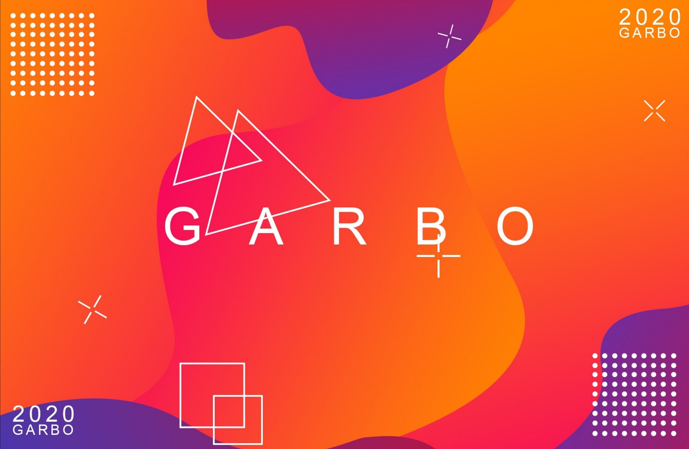

<!---->

### Hi there 👋 my name's Stanley

- 🧑‍🎓 A computer science major 
- 🌱 I’m currently learning software design patterns and how to write better code
- 📚 Currently reading node.js design patterns
- ⚙️ I’m currently focusing on TypeScript and Node.js
<!--
- 🔭 I’m currently working on ...

- 👯 I’m looking to collaborate on ...
- 🤔 I’m looking for help with ...
- 💬 Ask me about ...
-->
- 📫 How to reach me: stanleygarbo@gmail.com
<!---
- 😄 Pronouns: ...
- ⚡ Fun fact: ...
-->

<!--
**stanleygarbo/stanleygarbo** is a ✨ _special_ ✨ repository because its `README.md` (this file) appears on your GitHub profile.

Here are some ideas to get you started:

-->

 
